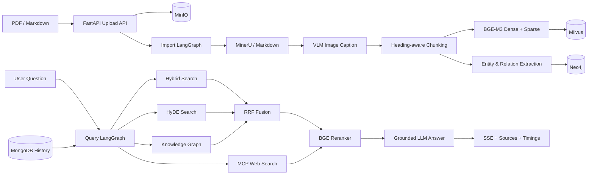

<div align="center">

# Shopkeeper Brain

### 店小智 · Hybrid RAG Knowledge Studio

把 PDF / Markdown 变成可以检索、可以追溯，也可以流式问答的多模态知识库。

Python 3.10+ · FastAPI · LangGraph · BGE-M3 · Milvus · Neo4j · MongoDB · MinIO

</div>

---

这是我在做知识库项目时整理出来的一版完整实现。最开始的目标很简单：把手册和 Markdown 文档放进来，然后能够问问题。实际做下来，真正麻烦的是文档解析、图片、检索结果合并、引用和失败处理，所以现在项目里把这些环节都串起来了。

项目里有两条 LangGraph 工作流：导入流程负责文档解析、图片理解、结构化切片和多存储入库；查询流程并行跑混合向量、HyDE、知识图谱和联网检索，再经过 RRF 和 BGE Reranker，最后生成带引用的回答。这样做的目的，是让答案尽量有证据可查，而不是只返回一段看起来合理的文字。

<table>
  <tr>
    <td width="50%"></td>
    <td width="50%"></td>
  </tr>
  <tr>
    <td align="center">智能问答 · 流式步骤 / 引用证据 / 检索轨迹</td>
    <td align="center">知识导入 · 批量上传 / 节点进度 / 失败反馈</td>
  </tr>
</table>

## 目前做了哪些事情

| 能力 | 实现 |
| --- | --- |
| 多模态导入 | MinerU PDF → Markdown，VLM 图片摘要与对象存储 URL |
| 结构化切片 | Markdown 1–6 级标题、父标题继承、递归切分、短块合并、重叠窗口 |
| 混合检索 | BGE-M3 Dense + Sparse、商品名标量过滤 |
| 多路召回 | Direct Hybrid、HyDE、Neo4j KG、MCP Web Search 并行执行 |
| 排序融合 | RRF 粗排、BGE Reranker 精排、断崖式动态 Top-K |
| 可信回答 | 空证据/低分拒答、正文 [1][2] 引用、结构化 sources/images/timings |
| 实时体验 | SSE Token 流、LangGraph 节点进度、任务状态与会话历史 |
| 前端界面 | 统一深色 Knowledge Studio、响应式问答页、批量拖拽导入 |
| 工程化 | 统一 ASGI 入口、CORS 白名单、上传校验、健康接口、Compose 基础设施 |

## 整体架构



### 导入工作流

```text
Entry → PDF/MD 分流 → MinerU → 图片理解 → 标题切片
      → 商品名识别 → BGE-M3 向量化 → Milvus → Neo4j（可选）
```

### 查询工作流

```text
历史会话 → 商品名确认 / Query Rewrite
        → [Direct | HyDE | KG | Web] 并行召回
        → RRF → Rerank + 动态截断 → Grounded Answer → SSE
```

## 快速开始

下面是我本地开发时使用的启动顺序。第一次安装模型和 MinerU 依赖会比较久，先准备好 Python、Docker 以及可用的模型服务。

### 1. 准备 Python

```powershell
python -m venv .venv
.\.venv\Scripts\Activate.ps1
python -m pip install --upgrade pip
pip install -r requirements-mineru.txt
```

只想先调 API 或 Markdown 流程时，可以安装相对轻量的 `requirements.txt`。MinerU 和本地 BGE 模型占用的依赖比较大；如果使用 GPU 版 PyTorch，请按照自己的 CUDA 版本从 PyTorch 官网安装，不要直接复制别人的 CUDA wheel。

### 2. 启动基础设施

```powershell
docker compose up -d
```

Compose 会启动 Milvus、MongoDB、Neo4j、MinIO，以及 Milvus 需要的 etcd。开发环境默认连接信息如下：

| 服务 | 地址 | 开发凭据 |
| --- | --- | --- |
| Milvus | `http://127.0.0.1:19530` | 无 |
| MongoDB | `mongodb://127.0.0.1:27017` | 无 |
| Neo4j Browser | `http://127.0.0.1:7474` | `neo4j / shopkeeper-dev` |
| MinIO Console | `http://127.0.0.1:9001` | `minioadmin / minioadmin` |

这些凭据只适合本机开发，部署前请换掉。

### 3. 配置环境变量

```powershell
Copy-Item knowledge\.env.example knowledge\.env
```

至少需要配置：

- `OPENAI_API_BASE`、`OPENAI_API_KEY` 和模型名；
- BGE-M3 / Reranker 的本地路径或 Hugging Face 模型 ID；
- Compose 对应的 Milvus、MongoDB、Neo4j、MinIO 连接信息。

项目里给的 RAG 参数是我根据第三章实践先放进去的一组起点，不是放之四海而皆准的最优值。建议拿自己的验证集和 bad case 继续调：

| 参数 | 默认值 |
| --- | ---: |
| Chunk 最大 / 最小字符 | 1200 / 300 |
| Chunk overlap | 约 1 句 |
| RRF k / 候选数 | 60 / 20 |
| Rerank 动态范围 | 6–15 |
| 断崖阈值 | 绝对 0.5 / 相对 25% |
| 低分拒答阈值 | 0.3 |

### 4. 启动应用

```powershell
python -m knowledge.main
```

也可以直接使用 Uvicorn：

```powershell
uvicorn knowledge.main:app --host 0.0.0.0 --port 8000
```

启动后可以打开：

- 问答工作台：<http://127.0.0.1:8000/chat.html>
- 知识导入：<http://127.0.0.1:8000/import.html>
- OpenAPI：<http://127.0.0.1:8000/docs>
- 服务健康：<http://127.0.0.1:8000/health>
- 能力状态：<http://127.0.0.1:8000/api/system>

根路径 `/` 会跳转到问答页。

## API

| Method | Path | 说明 |
| --- | --- | --- |
| POST | `/upload` | 上传 PDF / Markdown，返回任务 ID |
| GET | `/status/{task_id}` | 查看导入或问答任务状态 |
| POST | `/query` | 同步或流式问答 |
| GET | `/stream/{task_id}` | SSE 进度、Token 与最终结果 |
| GET | `/history/{session_id}` | 查看最近会话记录 |
| DELETE | `/history/{session_id}` | 清空会话 |
| GET | `/health` | Liveness |
| GET | `/api/system` | 不含密钥的能力/配置概览 |

非流式问答会返回证据和诊断信息，前端会据此展示引用卡片和检索轨迹：

```json
{
  "answer": "测量前先确认量程与表笔接口。[1]",
  "image_urls": [],
  "sources": [
    {
      "index": 1,
      "source": "local",
      "file_title": "设备使用手册",
      "title": "电压测量",
      "chunk_id": "1024",
      "score": 0.91,
      "preview": "……"
    }
  ],
  "diagnostics": {
    "trace_id": "task-id",
    "retrieval_counts": {"embedding": 10, "hyde": 10, "rerank": 6},
    "node_timings": {"rerank_node": 0.42},
    "total_time": 2.73
  }
}
```

## 项目结构

```text
knowledge/
├── api/                 # 上传、查询、系统接口
├── core/                # 应用配置、依赖与路径
├── front/               # 零构建依赖的 Knowledge Studio
├── processor/
│   ├── import_process/  # 文档导入 LangGraph
│   └── query_process/   # 多路检索 LangGraph
├── schema/              # Pydantic API 模型
├── service/             # 应用服务层
└── utils/               # Milvus / Mongo / MinIO / LLM / SSE
```

更详细的设计取舍，以及第三章经验在代码中的对应位置，见 [docs/architecture.md](docs/architecture.md)。

## 我是怎么验证的

```powershell
python -m unittest discover -s tests -v
python -m compileall -q -x "\\.venv|import_temp_Dir|__pycache__" knowledge tests scripts
python scripts/run_evaluation.py --provider contract --baseline evaluation/baselines/stage0-contract.core.json
```

最后一条命令运行无外部费用的契约门禁，但不声称测到了召回率。连接真实模型、
Milvus、Neo4j、MongoDB 和 Web MCP 的完整评测默认执行 `python scripts/run_evaluation.py`；
数据版本纪律与阶段 0 基线状态见
[`evaluation/README.md`](evaluation/README.md)。

GitHub Actions 也会执行同类的轻量单元测试和语法检查，但不会连接真实模型或外部数据库。完整的 MinerU、模型、Milvus、Neo4j、MongoDB 和 MinIO 链路，需要在自己的环境里再跑一遍。

## 安全提示

- `knowledge/.env` 只用于本机，并且已经被 `.gitignore` 排除；
- 如果旧密钥曾进入 Git 历史或发给过别人，请立即轮换，单纯删除文件是不够的；
- 上传接口默认只允许 PDF / Markdown，并限制文件大小；
- 文档内容是不可信输入，回答 Prompt 明确禁止执行资料中的提示注入指令；
- 生产环境还需要补上认证、RBAC、限流、审计，以及 HTML/Markdown 白名单净化。

## 当前边界与 Roadmap

当前版本更适合单机 Demo、学习和二次开发。任务状态与 SSE 通道还是进程内存实现，所以建议用单 Worker 运行。正式部署前，我还会继续补下面这些部分：

- Redis + Celery/RQ/Dramatiq 的持久任务、重试、取消与多副本 Pub/Sub；
- `document_id + sha256 + version + staging/active/retired` 两阶段发布；
- Milvus、Neo4j、MinIO 与商品名索引的一致删除和回滚；
- 文档列表、版本管理、重建索引与知识图谱可视化；
- RAGAS 数据集和 faithfulness / context precision / recall 回归；
- Prometheus、OpenTelemetry Trace、P95/P99 与 TTFT 监控。

这里不写未经实测的召回率、QPS 或用户规模。质量和性能数字应该由具体数据集及部署环境测出来。

## License

本项目采用 [MIT License](LICENSE)。第三方模型、数据集和基础设施镜像仍受各自许可证与服务条款约束。
