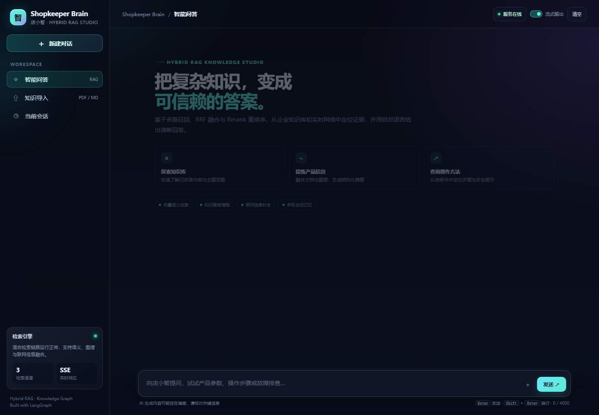
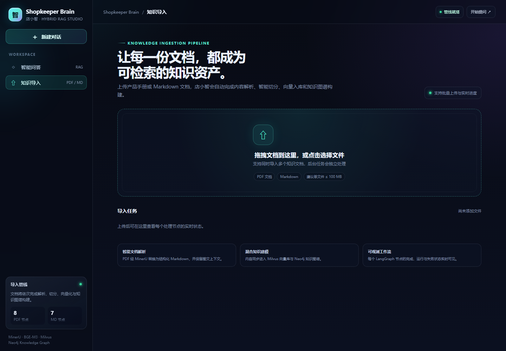
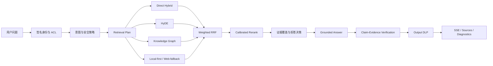
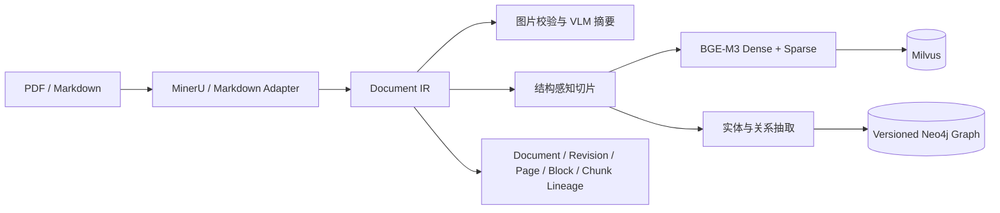

<div align="center">

# Shopkeeper Brain

### 店小智 · Industrial RAG Knowledge Studio

把 PDF / Markdown 变成可检索、可追溯、可授权、可评测、可回滚的多模态知识库。

Python 3.10+ · FastAPI · LangGraph · BGE-M3 · Milvus · Neo4j · MongoDB · MinIO

</div>

---

Shopkeeper Brain 不只是“召回几段文本再交给大模型”。阶段 2 把文档结构化 IR、多路检索、知识图谱、Web 路由、校准拒答、逐声明引用、安全策略和费用核算串成可观测的工业级 RAG 管线；阶段 3 又加入 PostgreSQL 企业知识生命周期、独立 scheduler/worker、增量同步、ACL/删除传播、不可变 Release、硬校验和回滚。

阶段 2 已于 2026-09-25 通过真实服务门禁。阶段 3 于 2026-09-26 通过 273 项自动化测试、15/15 基础设施故障演练、真实 PostgreSQL 并发/leader failover、真实 Redis 跨进程状态/SSE，以及真实 Milvus/Neo4j/MinIO ACL 与删除验收。历史失败证据均保留，没有回写或覆盖。

<table>
  <tr>
    <td width="50%"></td>
    <td width="50%"></td>
  </tr>
  <tr>
    <td align="center">智能问答 · 引用证据 / 检索轨迹 / 流式进度</td>
    <td align="center">知识导入 · 结构化 IR / 资产血缘 / 失败反馈</td>
  </tr>
</table>

## 阶段 2 实测结果

以下数据来自当前代码、真实 Milvus / Neo4j / MongoDB / Web / 模型服务，同一数据集每个用例执行 3 次。candidate 只与同轮 control 比较，使用仓库原有 `evaluation/gate.json`，没有降低门槛。

| 指标 | Control | Candidate | 结果 |
| --- | ---: | ---: | --- |
| 通过用例 | 12/12 | 12/12 | PASS |
| Recall@5 | 0.944444 | 0.944444 | 无回退 |
| Evidence-group / Section / Document Recall@5 | 0.944444 | 0.944444 | 无回退 |
| Citation correctness / Faithfulness | 1.0 / 1.0 | 1.0 / 1.0 | 通过 |
| 图片 / 行为 / 安全准确率 | 1.0 / 1.0 / 1.0 | 1.0 / 1.0 / 1.0 | 通过 |
| P95 延迟 | 6072.658 ms | 5918.720 ms | -2.53% |
| Token | 80,482 | 80,275 | -0.26% |
| 真实费用 | CNY 0.02296815 | CNY 0.02272920 | -1.04% |
| 成本状态 | available | available | 通过 |

Candidate 的 KG Recall@5 为 0.111111；独立真实 KG 探针召回 20 条 evidence，并验证 document、section、chunk 血缘及 `knowledge_graph` 来源类型。当前 query pipeline 指纹为 `56fdc795661541578271caf3a370eb12b4822d5a0a16597e9f1242f81718b07c`，pricing 指纹为 `dff7920ae0a2f1374786cb4e00169c25ed772923f8c493952fe3af7f348eab24`。

完整证据见：

- [阶段 2 架构 ADR](docs/roadmap/STAGE2_ARCHITECTURE_ADR.md)
- [阶段 2 最终验证](docs/roadmap/STAGE2_VALIDATION_20260925.md)
- [当前阶段状态](docs/roadmap/CURRENT_STAGE.md)
- `evaluation/results/stage2-acl-v2-release-control.20260925.service.full.*`
- `evaluation/results/stage2-acl-v2-release-candidate.20260925.service.full.*`
- `evaluation/results/stage2-acl-v2-release-kg-lineage-probe.20260925.service.json`
- `evaluation/baselines/stage2-industrial-rag-v2.0.0.20260925.service.full.*`

## 查询架构



关键设计：

- 身份、租户、角色和组只能来自服务端签名的短期上下文；请求正文不能自报权限。Direct、HyDE、KG 实体对齐、Neo4j 扩展和 chunk 回填都在召回前执行 ACL。
- 安全意图、Prompt Injection、普通业务问题、知识不足、实体歧义和时效问题走独立策略。注入内容被清洗后，合法业务问题仍会继续回答。
- Product / Safety 查询本地权威资料优先；只有时效意图或本地证据不足时才调用 Web。普通网页不能证明产品能力。
- reranker 原始 logit 只用于诊断；拒答使用校准相关性、Top-1 分差、authority、结构匹配和证据覆盖率的组合置信度。
- 答案先拆成 claim，再逐条绑定 evidence。无法核验的 claim 会被删除、降级或标记不确定，引用不会在答案生成后随意拼接。
- chunk 指标保留用于诊断，同时计算 canonical evidence-group、section 和 document 指标，避免靠重复 chunk 提高分数。
- Query rewrite、HyDE、KG entity 和 answer 分操作记录调用、Token、延迟与费用；费率、币种、区域、来源和生效日期位于 `config/model_pricing.json`。

## 导入架构



文档 IR 保留标题层级、表格归属、图片资产、页码、坐标和稳定血缘。新版本索引写入显式命名的 shadow collection；当前线上集合不会被建索引脚本直接覆盖。

## 快速开始

### 1. 安装依赖

```powershell
python -m venv .venv
.\.venv\Scripts\Activate.ps1
python -m pip install --upgrade pip
pip install -r requirements.txt
```

需要 PDF / MinerU 和完整本地模型能力时，改为安装 `requirements-mineru.txt`。GPU 版 PyTorch 应按本机 CUDA 版本安装。

### 2. 启动基础设施

```powershell
docker compose up -d
docker compose ps
```

Compose 会启动 PostgreSQL、Milvus、MongoDB、Neo4j、MinIO 和 etcd。2026-09 起上游不再公开原 MinIO 历史镜像，因此 Compose 使用内容摘要固定的归档副本；摘要仍是阶段 2 验证所用的 `a1ea29fa…b015e`，不会跟随浮动标签升级。

默认端口：PostgreSQL `5432`、Milvus `19530`、MongoDB `27017`、Neo4j Browser `7474`、MinIO API / Console `9000` / `9001`。Compose 中的默认凭据仅限本机开发，生产部署必须替换。

### 3. 配置应用

```powershell
Copy-Item knowledge\.env.example knowledge\.env
```

至少配置模型服务、BGE-M3 / reranker 路径、Milvus、Neo4j、MongoDB 和 MinIO。生产生命周期还必须配置 `LIFECYCLE_DATABASE_URL`、强随机 `LIFECYCLE_ADMIN_TOKEN` 和 secret reference；空 DSN 的 SQLite 模式只用于本地开发。启用受保护数据前必须配置强随机 `ACCESS_CONTEXT_HMAC_SECRET`，并由可信网关签发短期访问上下文；不要把 tenant、role 或 group 放进用户请求正文当作授权依据。

所有检索、融合、校准、拒答、Web、预算和安全参数集中在 `knowledge/processor/query_process/config.py`，通过环境变量覆盖；模型价格集中在 `config/model_pricing.json`，不硬编码在节点逻辑中。

### 4. 启动应用

```powershell
python -m knowledge.main
python -m knowledge.lifecycle.runtime scheduler
python -m knowledge.lifecycle.runtime worker
```

生产建议至少运行两个 worker；它们通过 PostgreSQL 行锁队列协作，同一 source 不会被并发处理。

企业生产主方案见 [分布式生产部署指南](docs/DISTRIBUTED_PRODUCTION_DEPLOYMENT.md)：多可用区 Kubernetes、API HPA、PostgreSQL leader lock 双 scheduler、KEDA worker、Redis 跨 Pod 状态/SSE、PDB、拓扑分散和 NetworkPolicy。没有现成集群时，可使用 [ACK Pro 三可用区 Terraform](deploy/terraform/alicloud-ack/README.md) 创建受管生产集群；已有三台 Linux 机器时，也可使用 [零新增云账单的三节点 K3s](deploy/k3s-ha/README.md) 做长期验证和小流量试运行。只有一台大内存 Windows 电脑时，可使用 [本机三虚拟机 K3s 验收集群](deploy/k3s-vagrant/README.md) 免费完成生产同构验收，但它不具备物理故障域隔离。单机 Compose 已降级为本地/边缘/灾备演练入口，见 [单机部署说明](docs/PRODUCTION_DEPLOYMENT.md)。

可访问：

- 问答工作台：<http://127.0.0.1:8000/chat.html>
- 知识导入：<http://127.0.0.1:8000/import.html>
- OpenAPI：<http://127.0.0.1:8000/docs>
- 健康检查：<http://127.0.0.1:8000/health>
- 能力状态：<http://127.0.0.1:8000/api/system>

## API 与诊断

| Method | Path | 说明 |
| --- | --- | --- |
| POST | `/upload` | 上传 PDF / Markdown，返回任务 ID |
| GET | `/status/{task_id}` | 查询导入或问答任务状态 |
| POST | `/query` | 同步或流式问答 |
| GET | `/stream/{task_id}` | SSE 进度与最终结果 |
| GET | `/history/{session_id}` | 查询当前授权主体的会话历史 |
| DELETE | `/history/{session_id}` | 清空当前授权主体的会话历史 |
| GET | `/health` | Liveness |
| GET | `/api/system` | 不含密钥的能力与配置概览 |
| GET | `/metrics` | 生命周期 Prometheus 指标 |
| * | `/api/lifecycle/admin/*` | 需 `X-Lifecycle-Admin-Token` 的 Source/Task/Release 运维接口 |

回答会返回结构化 `sources`、`images` 和 `diagnostics`。retrieval trace 保存每一路候选、融合与重排变化、过滤原因、拒答特征和最终证据，但不保存完整 Prompt、密钥或未经截断的敏感内容。

## 测试与真实评测

```powershell
.\knowledge\.venv\Scripts\python.exe -m unittest discover -s tests -v
.\knowledge\.venv\Scripts\python.exe -m compileall -q -x "\.venv|import_temp_Dir|__pycache__" knowledge tests scripts
.\knowledge\.venv\Scripts\python.exe scripts\run_evaluation.py --provider contract --output evaluation\results\contract.json
.\knowledge\.venv\Scripts\python.exe scripts\run_postgres_lifecycle_acceptance.py
.\knowledge\.venv\Scripts\python.exe scripts\run_production_storage_acceptance.py
```

契约评测不产生外部费用，也不声称测得真实召回率。真实门禁需要连接模型、Milvus、Neo4j、MongoDB 和 Web，并使用版本化 source contract、control baseline 与 `evaluation/gate.json`。数据集、历史报告和门禁纪律见 [evaluation/README.md](evaluation/README.md)。

## 发布与回滚

运行时回滚由 `config/releases/stage2-industrial-rag-v2.json` 管理。它只切换四个白名单键：chunk collection、index version、entity collection 和 graph version；不会修改密钥或其他环境配置。

先做 dry-run：

```powershell
.\knowledge\.venv\Scripts\python.exe scripts\switch_rag_release.py --target rollback
```

确认差异后应用：

```powershell
.\knowledge\.venv\Scripts\python.exe scripts\switch_rag_release.py --target rollback --apply
.\knowledge\.venv\Scripts\python.exe scripts\verify_stage2_index.py `
  --collection kb_chunks_ir_stage2_release_control_20260925 `
  --entity-collection kb_graph_entities_stage2_release_20260925 `
  --graph-version stage2-acl-kg-release-20260925 `
  --tenant-id public --item-name "HAK 180" --expected-chunks 129
```

恢复 candidate：

```powershell
.\knowledge\.venv\Scripts\python.exe scripts\switch_rag_release.py --target candidate --apply
```

每次应用前都会生成被 Git 忽略的 `knowledge/.env.bak.<UTC 时间>`，写入使用同目录原子替换。若当前环境不属于 manifest 中的任一已知版本，脚本默认拒绝切换；`--force` 只应在人工核对后使用。

代码版本使用两个带注释标签：

- `stage1-document-ir-v1.0.0`：阶段 2 之前的恢复点；
- `stage2-industrial-rag-v2.0.0`：本次阶段 2 发布点。

合并后如需撤销，应先切换到 ACL-compatible rollback 索引，再对主分支的阶段 2 合并提交执行 `git revert`。不要对共享主分支使用 `git reset --hard`。需要调查旧版本时，可从标签创建独立恢复分支：`git switch -c recovery/stage1 stage1-document-ir-v1.0.0`。

## 项目结构

```text
config/                         # 费率与发布清单
docs/roadmap/                   # 阶段状态、ADR、验证证据
evaluation/                     # 数据集、source contract、门禁与基线
knowledge/
├── api/                        # 上传、查询、系统接口
├── document_ir/                # 结构化文档、血缘与结构差异
├── evaluation/                 # 指标、usage 与评测运行器
├── observability/              # Token、延迟、费用与定价
├── processor/import_process/   # 导入 LangGraph
├── processor/query_process/    # 工业级查询 LangGraph
├── security/                   # 签名主体与 ACL
├── service/                    # 应用服务层
└── utils/                      # 存储、模型与输出工具
scripts/                        # 建索引、验收、评测和回滚工具
tests/                          # 单元与集成回归
```

## 安全与边界

- `knowledge/.env`、自动备份和运行日志均被 Git 忽略；真实密钥不得提交。
- 签名访问令牌严格校验格式、HMAC、受众和过期时间，并拒绝非规范 Base64URL 别名。
- 文档和 Web 内容都视为不可信输入；间接 Prompt Injection 会在进入 rerank / answer context 前隔离，输出再经过 DLP。
- 当前安全回归不等于覆盖所有未知攻击。生产环境仍需要网关认证、速率限制、密钥轮换、集中审计和持续监控。
- Web 与生成模型存在长期漂移；费率变化也会使旧成本报告失效。阶段 3 应继续建设灰度、在线 SLO、告警和自动回滚。

## License

本项目采用 [MIT License](LICENSE)。第三方模型、数据集、归档容器镜像和基础设施仍受各自许可证与服务条款约束。
